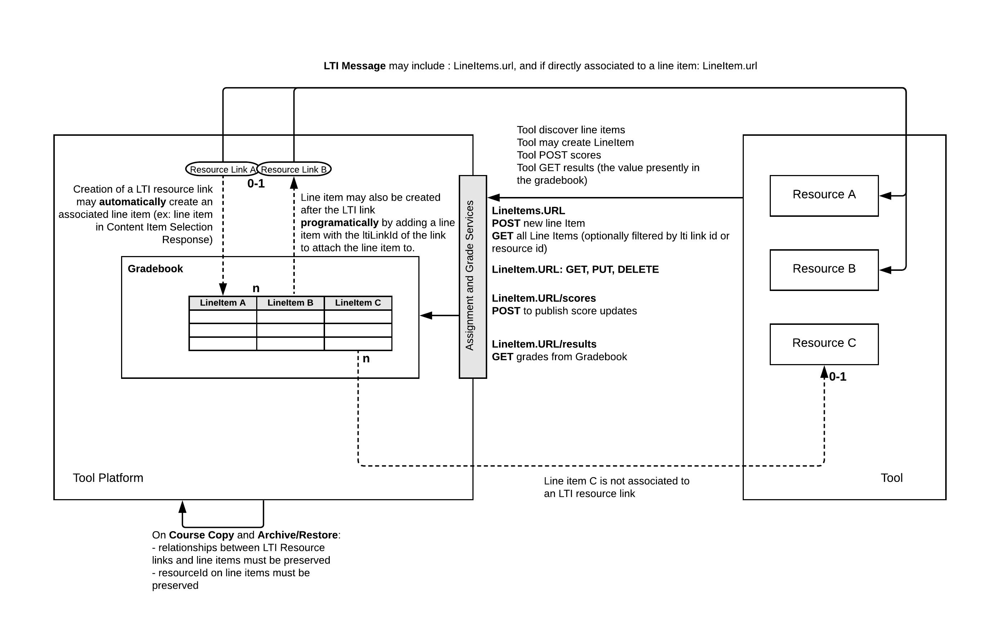

# LTI 1.3 Assignment Grading Services (AGS)

A library implementing the 1EdTechLTI 1.3 [Assignment Grading Services](https://www.imsglobal.org/spec/lti-ags/v2p0/) (AGS) Specification

<!-- PROJECT SHIELDS -->
<!--
*** I'm using markdown "reference style" links for readability.
*** Reference links are enclosed in brackets [ ] instead of parentheses ( ).
*** See the bottom of this document for the declaration of the reference variables
*** for contributors-url, forks-url, etc. This is an optional, concise syntax you may use.
*** https://www.markdownguide.org/basic-syntax/#reference-style-links
-->
[![MIT License][license-shield]][license-url]

<!-- TABLE OF CONTENTS -->
## Table of Contents
- [Installation](#installation)
- [Supported Methods](#supported-methods)
- [Usage](#usage)
- [License](#license)
- [Contact](#contact)

## Installation
```zsh
pnpm install lti-1p3-ags
```

## Supported LTI Version
[LTI 1.3](https://www.imsglobal.org/spec/lti/v1p3)

## General Overview

*Assignment and Grade Services Overview -- taken from the official 1EdTech AGS Specification*

## Supported Methods
```javascript
// Core methods:
init();
  // - have the ability to pass a callback if need be.
generateLTIAdvantageServicesAccessToken();

// lineitem CRUD methods
postScore();
createLineitem();
fetchAllLineitems();
fetchLineitem();

// Helper method that you can also import:
lessThanOneHourAgo();
```

Other CRUD operations currently in progress.

## Usage
The LTI 1.3 Core Specification won't be covered here, however, it would be good to familiarize yourself with the [specification](https://www.imsglobal.org/spec/lti/v1p3)
before utilizing this package. It would give you a core understanding behind the design choices and implementation differences from LTI 1.1.

The same is true for the LTI Advantage Assignment Grading Services (AGS) specification. I highly advise and recommend becoming
familiar with the new [specificiation](https://www.imsglobal.org/spec/lti-ags/v2p0/). An official migration guide is provided by 1EdTech, which could be found [here](https://www.imsglobal.org/spec/lti/v1p3/migr#migrating-from-basic-outcome-to-assignment-and-grade-services-2-0).
It briefly discusses the migration from the `Basic Outcome Service` to the new `Assignment Grading Services 2.0` (which is a part of the core LTI Advantage Services).

An important thing to note -- this library doesn't help you manage anything in relation to creating your public/private RSA keys. You will have to handle that on your own.
More information could be found in the official [1EdTech Security Framework](https://www.imsglobal.org/spec/security/v1p0/).

```javascript
/**
 * Testing for the AGS npm package module.
 */
import AGS from 'lti-1p3-ags';
import fs from 'fs';

try {

  /**
   * First and foremost, you have to create an AGS instance!
   * 
   * This library exposes two options for instantiating the AGS service:
   * 1. Statically
   * 2. Creating an AGS object instance.
   * 
   * In the end, both accomplish the same thing and this mainly comes down to how your application
   * is structured and how you want to use this library.
   */
  // Option 1:
  const ags = new AGS(
    issuer,
    clientId,
    deploymentId,
    oAuth2AccessEndpoint,
    keyId,
    fs.readFileSync('path/to/private-key.pem || string', 'utf-8'),
  );
  
  // Option 2:
  const ags = AGS.new(
    issuer,
    clientId,
    deploymentId,
    oAuth2AccessEndpoint,
    keyId,
    fs.readFileSync('path/to/private-key.pem || string', 'utf-8'),
  ).getAGSInstance();


  /**
   * After instantiating an AGS instance, you have 1 of 2 options to obtain an Access Token:
   * 1. invoke the `init()` method.
   * 2. explicitly invoke the `generateLTIAdvantageServicesAccessToken()` method.
   * 
   * Once again, determining which method to use mainly comes down to how your application
   * is structured and how you want to use this library but in the end, these two options accomplish
   * the same thing -- obtaining an Access Token.
   * 
   * This might be overkill, but one of my goals with this library was to implement it in such a way that
   * it could be expanded upon, potentially by other individuals, and leaving the choice up to the
   * individual to determine which method is best suited for the needs and application.
   */
  // Option 1:
  /**
   * You have the ability to pass an optional callback function, which will be invoked after
   * the Access Token has been fetched.
   */
  await ags.init();
  // OR
  await ags.init( (data) => {
    const {
      accessToken,
      createDate,
      tokenType,
    } = data;
    // Finished initializing!

    // Do something here if you need to!
  });

  // Option 2:
  const {
    accessToken,
    tokenType, // will always be `Bearer` in this instance.
    createdDate,
  } = await ags.generateLTIAdvantageServicesAccessToken();

  // From here, you can get or set the Access Token value and creation date if you would like:
  // Get:
  console.log(ags.accessToken);
  console.log(ags.accessTokenCreatedDate);
  // Set:
  ags.accessToken = 'some-access-token-you-already-generated';
  ags.accessTokenCreatedDate = 'access-tokens-creation-date';
  
  // Lastly, you can perform CRUD operatinos on lineitem(s):

  // Get all lineitems in context:
  const lineitems = await ags.fetchAllLineitems({
    lineitemsUrl: 'lineitems-url-endpoint',
  });
  console.log(lineitems);
  /**
   * [
      {
        id: 'https://lorem ipsum',
        scoreMaximum: 2,
        label: 'user profile - enable captions',
        resourceLinkId: 'resource-link-id'
      },
      {
        id: 'https://lorem ipsum',
        scoreMaximum: 40,
        label: 'Taylor Swift - All Of The Girls You Loved Before (Audio)',
        resourceLinkId: 'resource-link-id'
      },
      {
        id: 'https://lorem ipsum',
        scoreMaximum: 40,
        label: 'Moving | Official Trailer | Hulu',
        resourceLinkId: 'resource-link-id'
      }
    ]
  */

  // If you pass `params`, it will fetch the lineitems based on off the params passed:
  // You can also use the `fetchLineitem()` method to return a specific lineitem.
   const params = {
    resource_link_id: 'resource-link-id',
  };
  const lineitem = await ags.fetchAllLineitems({
    lineitemsUrl: 'lineitem-url-endpoint',
    params,
  });

  // OR

  // You can invoke the `fetchLineitem()` method to fetch a specific line item,
  // IF you have the `resourceId` value.
  const lineitem = await ags.fetchLineitem({
    lineitemsUrl,
    lineItemResourceId, // <-- This identifier has to conform to the value you gave the `resourceId` for the `lineitem`
  });
  console.log(lineitem);
  /**
   *
    {
      id: 'url-id',
      startDate: '',
      endDateTime: '',
      scoreMaximum: 10,
      label: '10 Second Timer -- new worth 10 points.',
      tag: 'grade',
      resourceId: '<whatever-value-was-given>',
      resourceLinkId: 'resource-link-id-value'
    }
  */

 // Posting scores:
 // Compile this data your own way, but has to conform to the object structure below.
 // More info could be found in the `StudentAttempt.d.ts`` interface. Reference link below.
 const studentAttempt = {
  pointsEarned,
  pointsAvailable,
  complete,
  gradeOutcomeUrl,
  modelInfo, // <-- info about content linked. Need just the name and id of that content.
};
const {
  status: gradePostResponseStatus, // Response status from making the AGS call.
  updatedScoresUrlEndpoint, // <-- don't have to do antying with this, but you can if you want to.
}  = await ags.postScore({
  resourceLinkId,
  studentAttempt,
  studentLti1p3UserId,
})

if (
  gradePostResponseStatus === 200
  || gradePostResponseStatus === 201
) {
  console.log('Succeeded in posting back scores!');
  if (updatedScoresUrlEndpoint) {
    console.log('Here is the updated scores url endpoint: ', updatedScoresUrlEndpoint);
  }
}

} catch (error) {
  console.log(error);  
}
```

[StudentAttempt.d.ts interface](https://github.com/Tyru5/1EdTech-LTI-1-3/blob/main/src/interfaces/StudentAttempt.d.ts)

<!-- LICENSE -->
## License
Distributed under the MIT License. See `LICENSE` for more information.

<!-- CONTACT -->
## Contact
Tyrus Malmstrom - [@TirustheVirus](https://twitter.com/TirustheVirus) - tyrusm@hotmail.com

<!-- MARKDOWN LINKS & IMAGES -->
<!-- https://www.markdownguide.org/basic-syntax/#reference-style-links -->

[license-shield]: https://img.shields.io/github/license/othneildrew/Best-README-Template.svg?style=flat-square
[license-url]: https://github.com/Tyru5/1EdTech-LTI-1-3/blob/main/LICENSE
